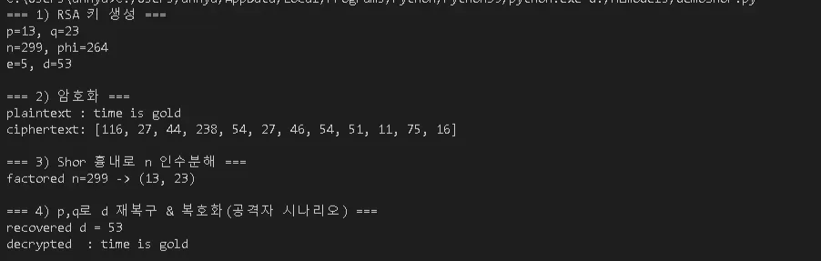

# 🔐 Toy RSA Decryption via Shor (Mock)

This is a minimal simulation of RSA decryption using classical logic inspired by Shor’s algorithm.

## 📄 What’s inside?

- A single Python script (`RSA_Decryption_Via_Shor.py`)
- Demonstrates:
  - RSA encryption/decryption
  - Period finding
  - Factoring small RSA moduli
  - Full attack flow (from ciphertext to recovered plaintext)

 ☕ Coffee not included, but highly recommended.

  
🖥️ View Output Screenshot

  

📌 **Note**

>This project is designed for **educational and demonstration purposes only.**  
>It does **not represent a practical or production-level implementation**, and does **not endorse** misuse of cryptographic simulations.
>
>
>📄 This project is licensed under the MIT License. See the [LICENSE](./LICENSE) file for details.
